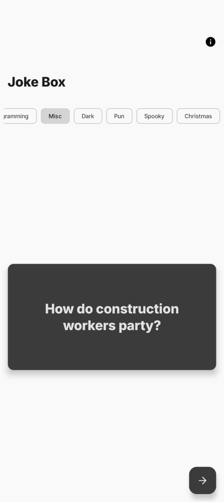
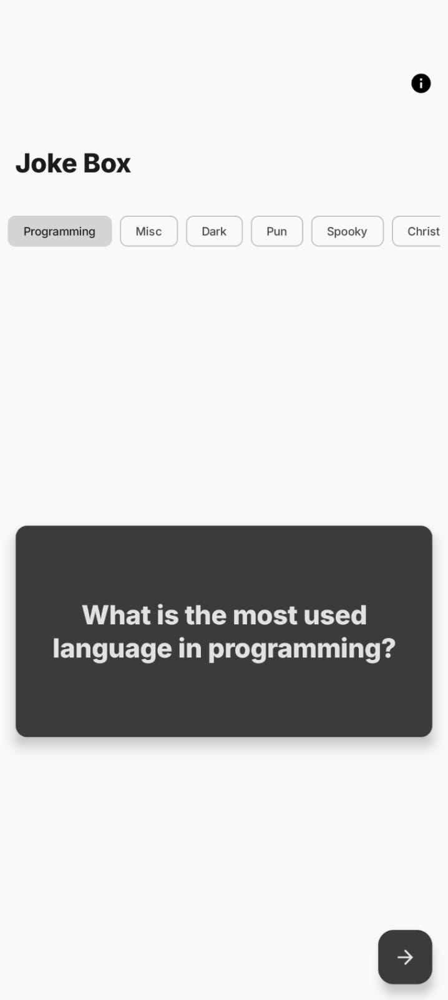
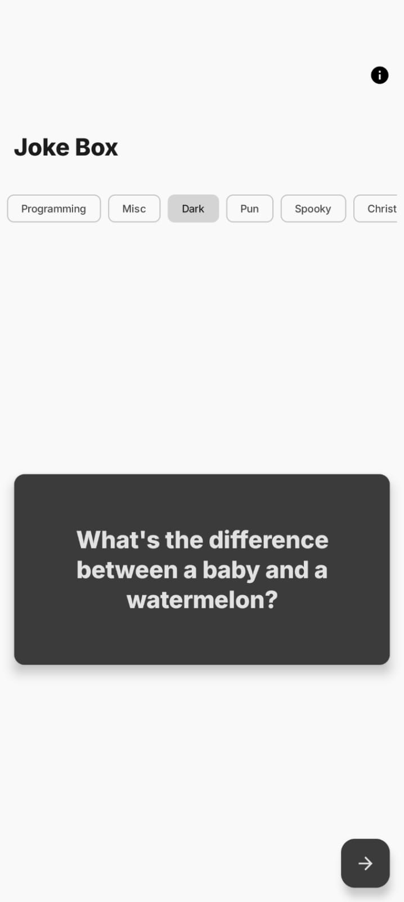

  

# Mastering the 'D' in SOLID

JokeBox is an Android application designed to demonstrate the implementation of the Dependency Inversion Principle (DIP) within a Clean Architecture framework. This project is to be featured and presented at **Android 254** on February 21, 2026, as a live case study on evolving software architecture.

## App Preview

|                  Screenshot 1                  |                  Screenshot 2                  |                  Screenshot 3                  |
|:----------------------------------------------:|:----------------------------------------------:|:----------------------------------------------:|
|  |  |  |

## Technical Specifications

* Language: Kotlin
* UI Framework: Jetpack Compose (Material 3)
* Architecture: MVVM + Clean Architecture
* Dependency Injection: Koin (Constructor DSL)
* Networking: Retrofit 2 + Gson
* Asynchrony: Kotlin Coroutines

---

## Architectural Implementation

The project is structured into three distinct layers to ensure a strict separation of concerns and to facilitate the "D" in SOLID.

### Domain Layer

The central layer containing the Business Logic. It defines the Repository interfaces (Abstractions) and Use Cases. This layer is independent of any external libraries or frameworks, ensuring it remains stable even if infrastructure changes.

### Data Layer

The infrastructure layer responsible for data retrieval. It implements the Repository interfaces defined in the Domain layer. It manages Retrofit instances and Data Source logic.

### Presentation Layer

The UI layer built with Jetpack Compose. ViewModels interact only with Use Case abstractions. The UI state is managed through a sealed interface pattern, handling Loading, Success, Error, and Empty states.

---

## Dependency Inversion in Practice

In this project, Dependency Inversion is achieved by:

1. Defining data contracts as interfaces in the Domain layer.
2. Injecting these interfaces into the ViewModels via constructors.
3. Using Koin as a service locator to provide concrete implementations at runtime.

This decoupling allows the developer to swap the data source (e.g., from a Remote API to a Mock service for testing) by changing a single line in the Dependency Injection module, without modifying the Business Logic or the UI components.

---

## Version History and Tags

The repository is tagged to show the step-by-step evolution of the architecture:

* v1-bad-example: Initial state with tightly coupled logic in the Activity.
* v2-domain-contract: Introduction of interfaces and Domain models.
* v3-clean-domain-and-usecase: Migration of logic into Use Cases.
* v4-presentation-refactor: Decoupling the UI from the ViewModel.
* v5-koin-di-integration: Implementation of automated Dependency Injection.
* v6-ui-layout-refactor: Final UX polish including category filtering.

---

## Installation

1. Clone the repository:
   git clone [https://github.com/iammuuo/joke-box.git](https://www.google.com/search?q=https://github.com/iammuuo/joke-box.git)
2. Open the project in Android Studio (Ladybug or newer).
3. Build and run the application.

---

## Presentation History

This project was showcased by the author at the **Android 254** meetup on **February 21, 2026**. The presentation focused on the transition from monolithic codebases to modular architectures using Kotlin and Jetpack Compose.

---

## License

This project is licensed under the MIT License.
